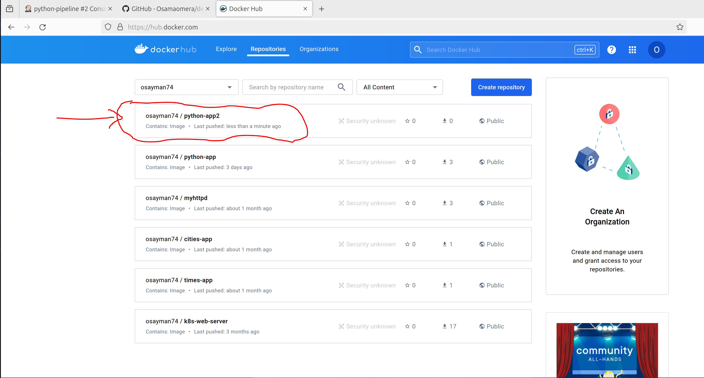
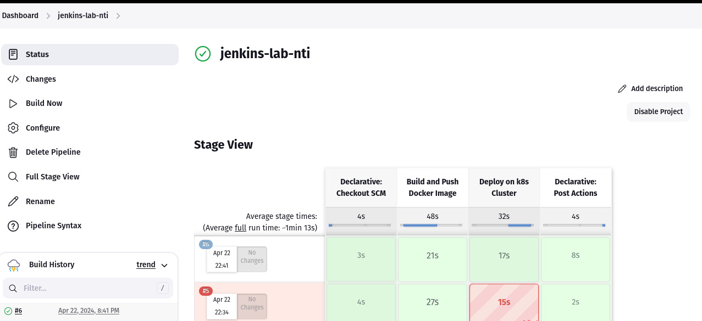
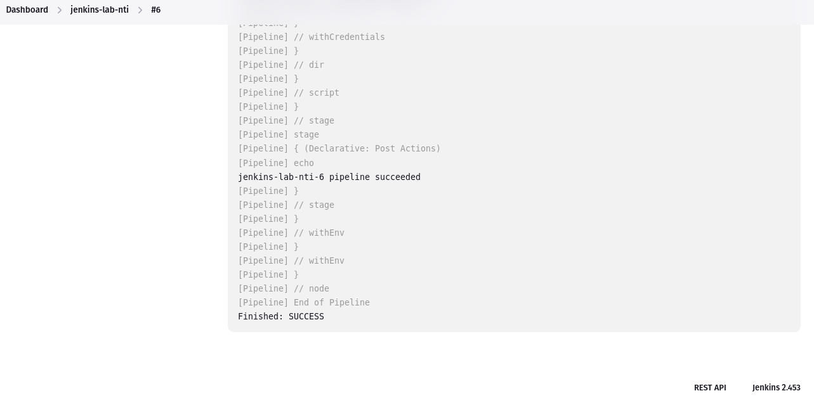

# Jenkins Pipeline 

> This document provides an overview of the Jenkins pipeline for building and deploying Dockerized applications to Kubernetes cluster.


## Pipeline Overview

The Jenkins pipeline follows these stages to build, push, and deploy Docker images to dockerhub and a Kubernetes cluster:

1. **Build and Push to DockerHub:** Build and push image to DockerHub.

2. **Update Deployment Manifest and Deploy to Kubernetes:** Update kubernetes deployment with the new image versions and deploy it to kubernetes cluster.

## Environment Variables

The following environment variables are used in the Jenkins pipeline:

- `APP_IMAGE_NAME`: dockerhub_repo/image_name.
- `Dockerfile_PATH`: path to Dockerfile in github repo.
- `DEPLOYMENT_PATH`: path to deployment file in github repo.
  

## Pipeline Steps

### Build and Push to DockerHub:

```
 stage('Build and Push Docker Image') {
            steps {
                script {
                	// Navigate to the directory contains Dockerfile
                 	dir('App') {
                 		buildandPushDockerImage("${dockerHubCredentialsID}", "${imageName}")
                }
              }
	    }
        }
```

### Update Deployment Manifest and Deploy to kubernetes:

```
 stage('Deploy on k8s Cluster') {
            steps {
                script { 
                        // Navigate to the directory contains kubernetes YAML files
                	dir('k8s') {
				deployOnKubernetes("${k8sCredentialsID}", "${imageName}")
                    	}
                }
            }
        }
```

### Post-Build Actions
In case of pipeline success or failure, the following messages will be displayed:

```
post {
        success {
            echo "${JOB_NAME}-${BUILD_NUMBER} pipeline succeeded"
        }
        failure {
            echo "${JOB_NAME}-${BUILD_NUMBER} pipeline failed"
        }
    }
```
----
### - Successfully the image pushed to repo of DockerHub


### - Successfully run the pipeline

#####################################################

---

### - Deployment from Kubernetes cluster

